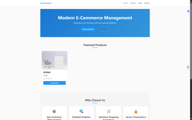
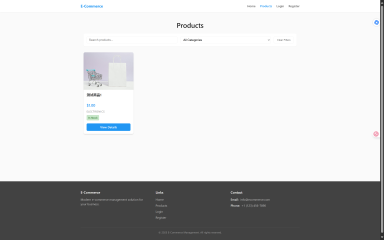
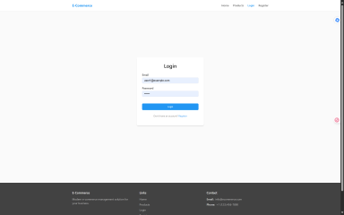
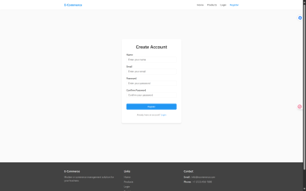

# 电商管理系统 (E-commerce Management System)

这是一个基于 Vue 3 + Node.js + MongoDB 的现代化电商管理系统。

## 界面预览

### 首页


### 商品列表


### 登录界面


### 注册界面



## 技术栈

### 前端
- Vue 3
- TypeScript
- Vite
- Vue Router
- Pinia (状态管理)
- Axios (HTTP 客户端)

### 后端
- Node.js
- Express
- MongoDB
- Mongoose
- JWT (身份认证)
- bcryptjs (密码加密)

## 功能特性

- 用户认证与授权
- 商品管理
- 订单管理
- 用户管理
- 数据统计与分析

## 项目结构

```
├── src/                # 前端源代码
├── server/            # 后端源代码
│   ├── middleware/    # 中间件
│   ├── models/        # 数据模型
│   ├── routes/        # 路由
│   └── index.js       # 服务器入口
├── public/            # 静态资源
└── package.json       # 项目配置
```

## 安装说明

1. 克隆项目
```bash
git clone [项目地址]
cd ecommerce-management-system
```

2. 安装依赖
```bash
# 安装前端依赖
npm install

# 安装后端依赖
cd server
npm install
```

3. 环境配置
- 在项目根目录创建 `.env` 文件
- 配置必要的环境变量（MongoDB 连接串、JWT 密钥等）

## 运行项目

### 开发环境
```bash
# 同时运行前端和后端
npm run dev:all

# 仅运行前端
npm run dev

# 仅运行后端
npm run server
```

### 生产环境
```bash
# 构建前端
npm run build

# 预览构建结果
npm run preview
```

## API 文档

API 文档请参考 `server/routes` 目录下的路由文件。

## 贡献指南

1. Fork 项目
2. 创建特性分支 (`git checkout -b feature/AmazingFeature`)
3. 提交更改 (`git commit -m 'Add some AmazingFeature'`)
4. 推送到分支 (`git push origin feature/AmazingFeature`)
5. 创建 Pull Request

## 许可证

[MIT License](LICENSE)
